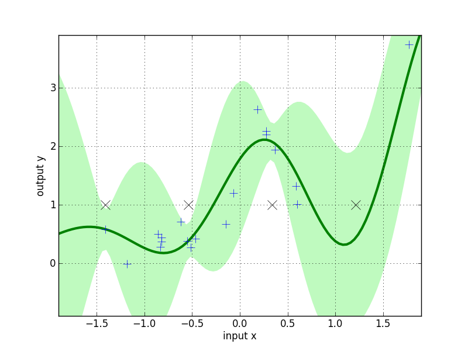
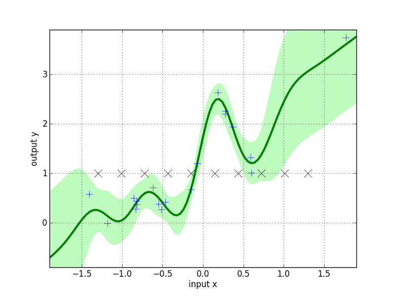

Sparse Regression
=========================

The code shown in this tutorial can be obtained by running */pyGPs/Demo/demo_GPR_FITC.py*
This demo is more or less similar to the demo of FITC classification.

First example -> default inducing points
-------------------
First load the same data as in the GPR demo.

**[Theory]**
In case the number of training inputs :math:`x` exceeds a few hundred, approximate inference using Laplacian Approximation or Expectation Propagation takes too long. We offer the FITC approximation 
based on a low-rank plus diagonal approximation to the exact covariance to deal with these cases. The general idea is to use inducing points 
:math:`u` and to base the computations on cross-covariances between training, test and inducing points only.

Okay, now the model is FITC regression: ::

	model = gp.GPR_FITC()  

The difference between the usage of basic :math:`GP` regression is that we will have to specify inducing points.
In the first example here, we will introduce you how to use the default settings.

The default inducing points are a grid (hypercube for higher dimensions), where each dimension has 5 values in equidistant steps in :math:`[min, max]`,
where :math:`min` and :math:`max` are the minimum and maximum values of the input data by default.
In order to specify the dimension of input data, we HAVE TO set data first: ::

    model.setData(x, y)

The number of inducing points per axis is :math:`5` per default.

Now, the regular training and prediction routines follow: ::

	model.train()            
	model.predict(z)
	model.plot()

The equidistant default inducing points :math:`u` that are shown in the figure as black x's.

To change the number of inducing points per axis just specify a different value per axis: ::

    model.setData(x, y, value_per_axis=10)

Second example -> user-defined inducing points
-----------------------------

Alternatively, a random subset of the training points can be used as inducing points. Moreover, there are planty of methods to set these inducing points.
So in the second example lets use a user-defined set of inducing points. ::

	num_u = np.fix(x.shape[0]/2)
	u = np.linspace(-1.3,1.3,num_u).T
	u = np.reshape(u,(num_u,1))

Here, we also use equi-spaced inducing points :math:`u`, but without the values on the margin of the grid.(i.e. shrinking the range of values) Then, we can just pass :math:`u` when specifying prior. ::

	m = mean.Zero()
	k = cov.RBFard(log_ell_list=[0.05,0.17], log_sigma=1.)
	model.setPrior(mean=m, kernel=k, inducing_points=u) 

The predicting results for this inducing points are shown below

**[Theory]**
Note that the predictive variance is 
overestimated outside the support of the inducing inputs. In a multivariate example where densely sampled inducing inputs are infeasible, one can simply use a random subset of the training points.
