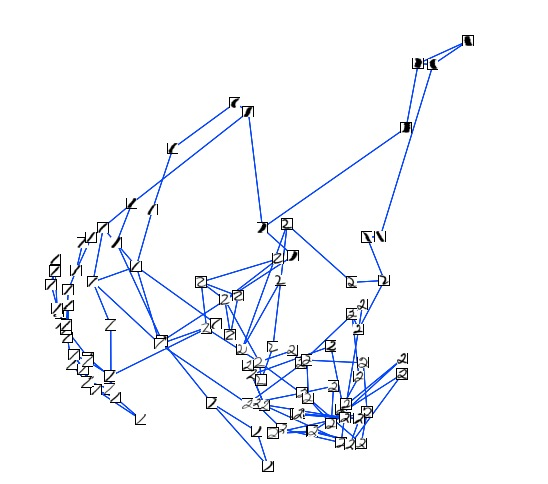

Semi-supervised Learning with Graphs
=======================================

The code shown in this tutorial can be executed by running *pyGPs/Demo/demo_NodeKernel.py*

Import
-------------------
You may want to import some extensions we provide as follows: ::

    from pyGPs.GraphExtension import graphUtil, nodeKernels
    from pyGPs.Validation import valid

Load data
--------------------
We used the same dataset from GPMC example. i.e. The USPS digits dataset [1]_.
Each digit of :math:`16*16` pixels is flattened into a :math:`256` dimension vector.
For the simplicity of demo, we only selected digits :math:`1` s and :math:`2` s such that we have a binary classification problem where digit :math:`1` for class +1 and digit :math:`2` for class -1. We also reduced the dataset into :math:`100` samples per digit, where the original dataset consist of thousands of samples for each digit.

Here are samples for two digits for :math:`1`

.. image:: _images/digit1_1.png
   :width: 30% 

.. image:: _images/digit1_2.png
   :width: 30% 

and samples for two digits for :math:`2`

.. image:: _images/digit2_1.png
   :width: 30% 

.. image:: _images/digit2_2.png
   :width: 30% 

Form a nearest neighbour graph
--------------------------------
We form a nearest-neighbor graph based on Euclidean distance of the vector representation of digits. Neighboring images have small Euclidean distance. Each digit is a node in the graph. There is an edge if digit :math:`i` is the k-nearest neighbour of digit :math:`j`. We form a symmetrized graph such that we connect nodes :math:`j`, :math:`i` if i is in j’s kNN and vice versa, and therefore a node can have more than k edges. You should import the corresponding module from *pyGPs.GraphStuff* ::

    x,y = load_binary(1,2,reduce=True)
    A = graphUtil.formKnnGraph(x,2)

A is the adjacency matrix of this :math:`2-NN` graph.

Below shows an example of such symmetrized Euclidean :math:`2-NN` graph on some 1s and 2s taking from Xiaojin Zhu's doctoral thesis [2]_.

Kernel on graph
------------------
Several classical kernels on graph described in `Structured Kernels`_ can be built from adjacency matrix :math:`A`. We use diffusion kernel for this example to get the precomputed kernel matrix. ::

    Matrix = nodeKernels.diffKernel(A)

.. _Structured Kernels: Graph.html

This a big square matrix with all rows and columns of the number of data points.
By specifying the indice of training data and test data, we will form two matrix M1 and M2 with the exact format which *pyGPs.Core.cov.Pre* needed. ::

    M1,M2 = graphUtil.formKernelMatrix(Matrix, indice_train, indice_test)

M1 is a matrix with shape **number of training points plus 1** by **number of test points** 
 - cross covariances matrix (train by test) 
 - last row is self covariances (diagonal of test by test)
M2 is a square matrix with **number of training points** for each dimension
 - training set covariance matrix (train by train)  

GP classification
-----------------------
Every ingredients for a basic semi-supervised learning is prepared now.  Lets see how to proceed for :math:`GP` classification. First, the normal way with rbf kernel we have seen several times ::

        model = pyGPs.GPC()
        k = pyGPs.cov.RBF()
        model.setPrior(kernel=k)

Then lets use our kernel precomputed matrix. If you only use precomputed kernel matrix, there is no training data.
However you still need to specify :math:`x` just to fit in the usage of pyGPs for generality reason. 
You can create any :math:`x` as long as the dimension is correct. ::

        x = np.zeros((n,1))
        k = pyGPs.cov.Pre(M1,M2) + pyGPs.cov.RBF()
        model.setPrior(kernel=k)

Moreover, you can composite a kernel for both precomputed matrix and regular kernel function if necessary. ::

        k = pyGPs.cov.Pre(M1,M2) + pyGPs.cov.RBFunit()
        model.setPrior(kernel=k)

The rest way of using pyGPs is exactly the same as the demo of GP classification.

Result
-----------------------
For our manually created graph data, an rbf kernel works better than a diffusion kernel on the graph (higher accuracy). The performance in general should depend on the application as well as features of data.

The left image shows the digit that using diffusion kernel will predict the wrong result (should be :math:`2`), 
but rbf kernel does the job fine. The right image shows the digit that rbf kernel predicts the wrong class, diffusion kernel on the other hand, predicts correctly due to graph information! (should be :math:`1`).

Interestingly, using a composite kernel with diffusion kernel on graph and an rbf kernel together. All test cases including the following are predicted correctly.

.. image:: _images/digitDiffwrong.png
   :width: 50% 

.. image:: _images/digitRBFwrong.png
   :width: 50% 

.. [1] A Database for Handwritten Text Recognition Research, J. J. Hull, IEEE PAMI 16(5) 550-554, 1994.
.. [2] Semi-Supervised Learning with Graphs, Xiaojin Zhu, CMU-LTI-05-192, 2005
